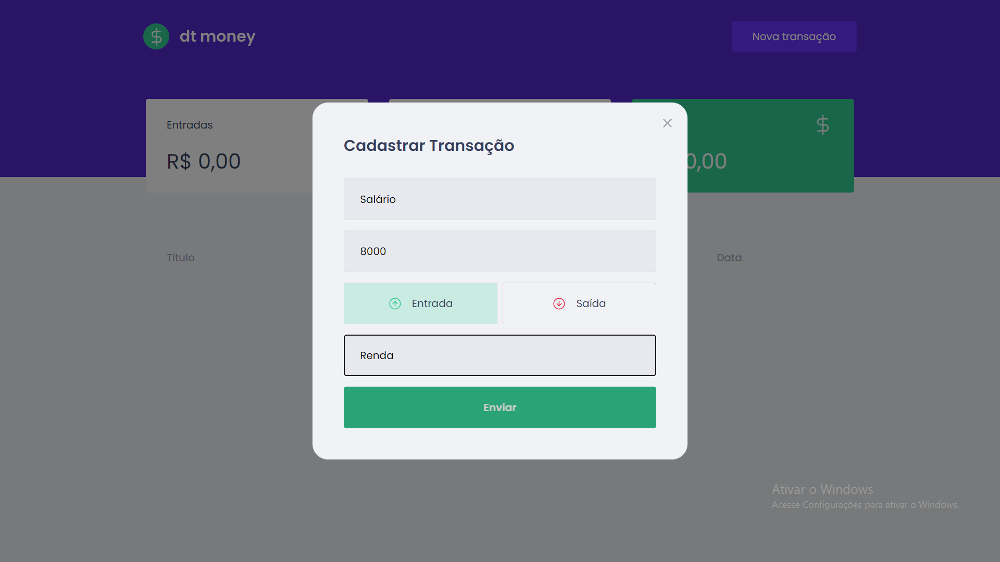
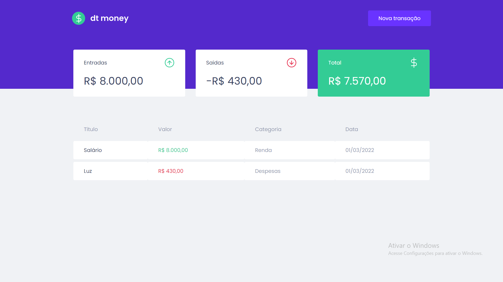

# Dt MONEY

Aplicação Financeira, gestão de controle financeiro, entrada e saída.

## Desenvolvimento
* Reactjs - framework
* Styled-components - estiliização
* Typescript
* Miragejs - simulador API
* Axios
* Polished -  ajuda a manipular cores com javascript em styled-components
* Context API no React - Armazenar estados globais.

## Resultado

## Colaboradores

<table>
  <tr>
    <td align="center">
      <a href="#">
         
        
          <b>Lázaro Pimentel</b>
        
      </a>
    </td>
  </tr>
</table>
